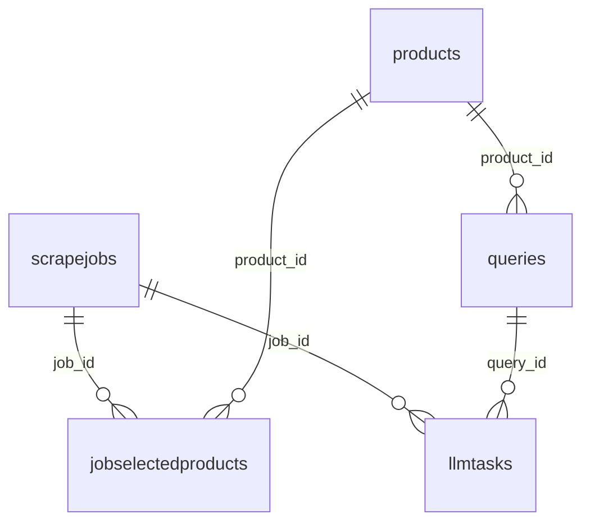

# Bodhium Database Schema

**Database Name:** `bodhium-dev`

## Overview
This document describes the database schema for the Bodhium application, including all tables, their relationships, and field definitions.

## Tables

### 1. `scrapejobs`
Stores information about web scraping jobs.

| Column | Type | Constraints | Description |
|--------|------|-------------|-------------|
| `job_id` | `uuid` | `NOT NULL, PRIMARY KEY` | Unique identifier for the scraping job |
| `source_url` | `text` | `NULL` | URL of the source to be scraped |
| `status` | `varchar(50)` | `NULL` | Current status of the scraping job |
| `created_at` | `timestamp with time zone` | `NULL, DEFAULT: CURRENT_TIMESTAMP` | When the job was created |
| `updated_at` | `timestamp with time zone` | `NULL, DEFAULT: CURRENT_TIMESTAMP` | When the job was last updated |
| `brand_name` | `varchar(255)` | `NULL` | Name of the brand being scraped |

### 2. `products`
Stores product information extracted from scraping jobs.

| Column | Type | Constraints | Description |
|--------|------|-------------|-------------|
| `product_id` | `bigint` | `NOT NULL, AUTO_INCREMENT, PRIMARY KEY` | Unique identifier for the product |
| `product_hash` | `varchar(256)` | `NULL` | Hash value for product identification |
| `product_data` | `jsonb` | `NULL` | JSON data containing product information |
| `source_url` | `text` | `NULL` | URL where the product was found |
| `first_scraped_at` | `timestamp with time zone` | `NULL, DEFAULT: CURRENT_TIMESTAMP` | When the product was first scraped |
| `brand_name` | `varchar(255)` | `NULL` | Brand name associated with the product |

### 3. `jobselectedproducts`
Junction table linking scraping jobs to selected products.

| Column | Type | Constraints | Description |
|--------|------|-------------|-------------|
| `job_id` | `uuid` | `NOT NULL, FOREIGN KEY` | References `scrapejobs.job_id` |
| `product_id` | `bigint` | `NOT NULL, FOREIGN KEY` | References `products.product_id` |

**Primary Key:** `(job_id, product_id)` (Composite)

### 4. `queries`
Stores queries related to products for LLM processing.

| Column | Type | Constraints | Description |
|--------|------|-------------|-------------|
| `query_id` | `bigint` | `NOT NULL, AUTO_INCREMENT, PRIMARY KEY` | Unique identifier for the query |
| `product_id` | `bigint` | `NULL, FOREIGN KEY` | References `products.product_id` |
| `query_text` | `text` | `NULL` | The actual query text |
| `query_type` | `varchar(50)` | `NULL` | Type/category of the query |
| `is_active` | `boolean` | `NULL, DEFAULT: true` | Whether the query is currently active |

### 5. `llmtasks`
Stores LLM processing tasks and their status.

| Column | Type | Constraints | Description |
|--------|------|-------------|-------------|
| `task_id` | `uuid` | `NOT NULL, PRIMARY KEY` | Unique identifier for the LLM task |
| `job_id` | `uuid` | `NULL, FOREIGN KEY` | References `scrapejobs.job_id` |
| `query_id` | `bigint` | `NULL, FOREIGN KEY` | References `queries.query_id` |
| `llm_model_name` | `varchar(100)` | `NULL` | Name of the LLM model used |
| `status` | `varchar(50)` | `NULL` | Current status of the task |
| `s3_output_path` | `text` | `NULL` | S3 path where output is stored |
| `error_message` | `text` | `NULL` | Error message if task failed |
| `created_at` | `timestamp with time zone` | `NULL, DEFAULT: CURRENT_TIMESTAMP` | When the task was created |
| `completed_at` | `timestamp with time zone` | `NULL` | When the task was completed |
| `product_id` | `bigint` | Foreign key reference to `products.product_id` |
| `product_name` | `text` | Product name extracted from `products.product_data` JSON |

## Relationships

### Foreign Key Relationships

### Relationship Details

| Relationship | From Table | To Table | Foreign Key | Description |
|--------------|------------|----------|-------------|-------------|
| Job Products | `jobselectedproducts` | `scrapejobs` | `job_id` | Links selected products to their scraping job |
| Product Queries | `queries` | `products` | `product_id` | Links queries to specific products |
| Job Tasks | `llmtasks` | `scrapejobs` | `job_id` | Links LLM tasks to scraping jobs |
| Query Tasks | `llmtasks` | `queries` | `query_id` | Links LLM tasks to specific queries |

## Data Flow

1. **Scraping Process**: `scrapejobs` → `products` → `jobselectedproducts`
2. **Query Generation**: `products` → `queries`
3. **LLM Processing**: `scrapejobs` + `queries` → `llmtasks`

## Notes

- All timestamp fields use timezone-aware timestamps
- UUID fields are used for job and task identification
- JSONB is used for flexible product data storage
- Composite primary keys are used for junction tables
- Foreign key relationships maintain referential integrity