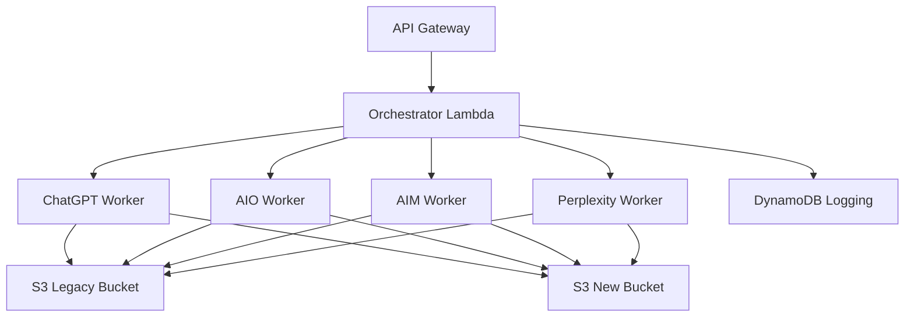

# Bodhium Orchestrator Lambda Documentation

The orchestrator is the central component that receives job requests and fans out queries to multiple worker Lambda functions (AIO, AIM, ChatGPT, Perplexity).

## Overview

The orchestrator Lambda:
- ✅ **Accepts job requests** with queries grouped by product
- ✅ **Generates unique identifiers** (job_id, query_id)
- ✅ **Routes queries** to appropriate worker Lambdas
- ✅ **Supports model selection** via explicit tags or keyword inference
- ✅ **Logs orchestration events** to DynamoDB
- ✅ **Maintains backward compatibility** with old API format
- ✅ **Returns immediate response** (202 Accepted) while workers run asynchronously

## Architecture



## Environment Variables

| Variable | Description | Default Value |
|----------|-------------|---------------|
| `ORCHESTRATION_LOGS_TABLE` | DynamoDB table for orchestration logs | `OrchestrationLogs` |
| `DB_SECRET_NAME` | AWS Secrets Manager secret name for RDS credentials | `rds-db-credentials/cluster-bodhium/bodhium` |
| `LAMBDA_CHATGPT` | ChatGPT worker Lambda ARN | `arn:aws:lambda:us-east-1:127214200395:function:bodhium-llm-chatgpt` |
| `LAMBDA_AIOVERVIEW` | AI Overview worker Lambda ARN | `arn:aws:lambda:us-east-1:127214200395:function:bodhium-llm-aioverview` |
| `LAMBDA_AIMODE` | AI Mode worker Lambda ARN | `arn:aws:lambda:us-east-1:127214200395:function:bodhium-llm-aimode` |
| `LAMBDA_PERPLEXITYAPI` | Perplexity worker Lambda ARN | `arn:aws:lambda:us-east-1:127214200395:function:bodhium-llm-perplexityapi` |

## Input Formats

### Enhanced Format (Latest - Recommended)

Supports mixing existing queries (with their original query IDs) and new queries (that get fresh query IDs):

```json
{
  "job_id": "550e8400-e29b-41d4-a716-446655440000",
  "selected_queries": [
    {
      "product_id": "product-123",
      "existing_queries": [
        {
          "query_id": 456,
          "query_text": "What are the best smartphones in India?"
        },
        {
          "query_id": 789,
          "query_text": "Latest mobile phone trends"
        }
      ],
      "new_queries": [
        "Compare iPhone 15 Pro vs Samsung S24 Ultra",
        "Best budget phones under $500"
      ]
    },
    {
      "product_id": "product-456",
      "new_queries": [
        "What is the market share of Apple in India?"
      ]
    }
  ],
  "options": {
    "priority": "high",
    "timeout": 300
  }
}
```

### Previous Format (Still Supported)

```json
{
  "job_id": "550e8400-e29b-41d4-a716-446655440000",
  "selected_queries": [
    {
      "product_id": "product-123",
      "queries": [
        "What are the best smartphones in India?",
        "Compare iPhone 15 Pro vs Samsung S24 Ultra"
      ]
    },
    {
      "product_id": "product-456", 
      "queries": [
        "What is the market share of Apple in India?"
      ]
    }
  ],
  "options": {
    "priority": "high",
    "timeout": 300
  }
}
```

### Old Format (Backward Compatible)

```json
{
  "job_id": "550e8400-e29b-41d4-a716-446655440000",
  "queries": [
    "What are the best smartphones in India?",
    "Compare iPhone 15 Pro vs Samsung S24 Ultra"
  ]
}
```

## Query ID Management

### Enhanced Format Query ID Logic

The orchestrator intelligently manages query IDs and database storage:

1. **Existing Queries**: Use their provided `query_id` values as-is (already in database)
2. **New Queries**: Insert into `queries` table first to get auto-generated `query_id` from database

#### Example:

**Input:**
```json
{
  "selected_queries": [
    {
      "product_id": "product-A",
      "existing_queries": [
        {"query_id": 456, "query_text": "Existing query 1"},
        {"query_id": 789, "query_text": "Existing query 2"}
      ],
      "new_queries": [
        "New query 1",
        "New query 2"
      ]
    }
  ]
}
```

**Processing Flow:**
1. Existing query 1: `query_id = 456` (used as-is, already in database)
2. Existing query 2: `query_id = 789` (used as-is, already in database)
3. New query 1: Insert into database → `query_id = auto-generated` (e.g., 1001)
4. New query 2: Insert into database → `query_id = auto-generated` (e.g., 1002)

### Database Integration:
- ✅ **Persistent Storage**: New queries automatically stored in `queries` table
- ✅ **Auto-Generated IDs**: Database provides unique, sequential `query_id` values
- ✅ **Data Integrity**: Foreign key relationship to `products` table
- ✅ **Query Tracking**: Full audit trail of all queries with metadata
- ✅ **Fallback Mechanism**: If database fails, uses generated IDs and continues processing

## Model Selection

### Explicit Model Routing

Use `::model_name$` tags to route to specific models:

```json
{
  "job_id": "test-explicit-routing",
  "selected_queries": [
    {
      "product_id": "product-123",
      "queries": [
        "What are the best smartphones? ::chatgpt$",
        "Compare iPhones ::aio,aim$",
        "Market analysis ::perplexity$"
      ]
    }
  ]
}
```

### Keyword-Based Routing

Keywords automatically route to relevant models:

| Keyword | Routes To |
|---------|-----------|
| `chatgpt` | ChatGPT worker |
| `aio`, `ai overview`, `aioverview` | AIO worker |
| `aim`, `ai mode` | AIM worker |
| `perplexity` | Perplexity worker |

### Fan-out (Default)

If no explicit tags or keywords are found, the query fans out to all workers.

## Test JSON Events

### Test Event 1: Enhanced Format with Existing and New Queries

```json
{
  "body": "{\"job_id\":\"test-job-001\",\"selected_queries\":[{\"product_id\":\"product-smartphones\",\"existing_queries\":[{\"query_id\":456,\"query_text\":\"What are the best smartphones in India?\"},{\"query_id\":789,\"query_text\":\"Latest mobile phone trends ::chatgpt$\"}],\"new_queries\":[\"Compare iPhone 15 Pro vs Samsung S24 Ultra\",\"Show me AI overview of latest phones ::aio$\"]},{\"product_id\":\"product-laptops\",\"new_queries\":[\"Best gaming laptops under $2000\",\"Compare MacBook Pro vs Dell XPS ::aim$\"]}],\"options\":{\"priority\":\"high\"}}"
}
```

### Test Event 1b: Multi-Product with Mixed Routing (Previous Format)

```json
{
  "body": "{\"job_id\":\"test-job-001b\",\"selected_queries\":[{\"product_id\":\"product-smartphones\",\"queries\":[\"What are the best smartphones in India?\",\"Compare iPhone 15 Pro vs Samsung S24 Ultra ::chatgpt$\",\"Show me AI overview of latest phones ::aio$\"]},{\"product_id\":\"product-laptops\",\"queries\":[\"Best gaming laptops under $2000\",\"Compare MacBook Pro vs Dell XPS ::aim$\"]}],\"options\":{\"priority\":\"high\"}}"
}
```

### Test Event 2: Single Product with Fan-out

```json
{
  "body": "{\"job_id\":\"test-job-002\",\"selected_queries\":[{\"product_id\":\"product-headphones\",\"queries\":[\"Best wireless headphones 2024\",\"Noise cancelling headphones comparison\"]}]}"
}
```

### Test Event 3: Backward Compatibility Test

```json
{
  "body": "{\"job_id\":\"test-job-003\",\"queries\":[\"What are the latest tech trends?\",\"Compare AI tools for productivity\"]}"
}
```

### Test Event 4: Direct Lambda Invocation (Enhanced Format)

```json
{
  "job_id": "test-job-004",
  "selected_queries": [
    {
      "product_id": "product-cameras",
      "existing_queries": [
        {
          "query_id": 101,
          "query_text": "Best DSLR cameras for beginners"
        }
      ],
      "new_queries": [
        "Mirrorless vs DSLR comparison ::perplexity$"
      ]
    }
  ]
}
```

### Test Event 4b: Direct Lambda Invocation (Previous Format)

```json
{
  "job_id": "test-job-004b",
  "selected_queries": [
    {
      "product_id": "product-cameras",
      "queries": [
        "Best DSLR cameras for beginners",
        "Mirrorless vs DSLR comparison ::perplexity$"
      ]
    }
  ]
}
```

### Test Event 5: Explicit Multi-Model Routing

```json
{
  "body": "{\"job_id\":\"test-job-005\",\"selected_queries\":[{\"product_id\":\"product-tablets\",\"queries\":[\"iPad Pro vs Surface Pro analysis ::chatgpt,aio$\",\"Best tablets for students ::aim,perplexity$\"]}]}"
}
```

## Response Format

### Success Response (202 Accepted)

```json
{
  "statusCode": 202,
  "headers": {
    "Content-Type": "application/json",
    "Access-Control-Allow-Origin": "*",
    "Access-Control-Allow-Headers": "Content-Type",
    "Access-Control-Allow-Methods": "POST, OPTIONS"
  },
  "body": {
    "status": "accepted",
    "message": "Job submitted successfully. All lambdas have been triggered.",
    "job_id": "test-job-001",
    "product_groups_count": 2,
    "total_queries_count": 5,
    "polling_info": {
      "table_name": "OrchestrationLogs",
      "query_example": "SELECT * FROM OrchestrationLogs WHERE job_id = 'test-job-001'"
    }
  }
}
```

### Error Response

```json
{
  "error": "No selected_queries provided"
}
```

## DynamoDB Logging Structure

### Table: OrchestrationLogs

| Field | Type | Description |
|-------|------|-------------|
| `pk` | String | Partition key: `JOB#{job_id}` |
| `sk` | String | Sort key: `{timestamp}#{unique_id}` |
| `job_id` | String | Job identifier |
| `event_timestamp_id` | String | Event timestamp with unique ID |
| `eventName` | String | Event type (see Event Types below) |
| `details` | Map | Event-specific details |

### Event Types

| Event Name | Description | Details Include |
|------------|-------------|-----------------|
| `OrchestrationStarted` | Job processing begins | Full event, context info |
| `ProductProcessingStarted` | Product group processing begins | `product_id`, `query_count` |
| `ModelSelectionCompleted` | Model selection for query completed | `query_id`, `product_id`, `selected_models` |
| `FanoutStarted` | Fan-out to all models initiated | `query_id`, `product_id`, `target_count` |
| `FanoutCompleted` | Fan-out completed | `query_id`, `product_id`, `target_count` |
| `{Model}LambdaTriggered` | Worker Lambda triggered | `lambda_arn`, `payload_size`, `query_id` |
| `{Model}LambdaTriggerFailed` | Worker Lambda trigger failed | `lambda_arn`, `error`, `query_id` |
| `ProductProcessingCompleted` | Product group processing completed | `product_id`, `queries_processed` |
| `OrchestrationCompleted` | Job processing completed | `product_groups_processed`, `total_queries` |
| `OrchestrationFailed` | Job processing failed | `error` |

## Worker Payload Format

Each worker receives this payload:

```json
{
  "query": "What are the best smartphones in India?",
  "job_id": "test-job-001",
  "query_id": 1,
  "product_id": "product-smartphones"
}
```

## Error Handling

### Input Validation
- Missing `selected_queries`: Returns error message
- Invalid JSON: Returns parse error
- Missing `product_id` in product group: Skips group with warning
- Empty `queries` array: Skips product with warning

### Lambda Trigger Failures
- Individual Lambda failures don't stop overall processing
- Failures are logged to DynamoDB with error details
- Other workers continue processing

### DynamoDB Logging Failures
- Logged as errors but don't stop processing
- Application continues with reduced observability

## Manual Deployment Instructions

### Prerequisites
- AWS CLI configured with appropriate permissions
- Access to AWS Lambda Console
- DynamoDB table `OrchestrationLogs` exists
- RDS PostgreSQL database with `queries` table
- AWS Secrets Manager secret with database credentials
- Lambda execution role with required permissions

### Deployment Steps

1. **Update Lambda Function Code**
   ```bash
   # Option 1: Via AWS CLI
   zip -r orchestrator.zip orchestrator.py
   aws lambda update-function-code \
     --function-name bodhium-llm-orchestrator \
     --zip-file fileb://orchestrator.zip
   
   # Option 2: Via AWS Console
   # 1. Go to AWS Lambda Console
   # 2. Find "bodhium-llm-orchestrator" function
   # 3. Upload new code via "Upload from" -> ".zip file"
   ```

2. **Verify Environment Variables**
   ```bash
   aws lambda get-function-configuration \
     --function-name bodhium-llm-orchestrator \
     --query 'Environment.Variables'
   ```

3. **Test Function**
   ```bash
   aws lambda invoke \
     --function-name bodhium-llm-orchestrator \
     --payload '{"body":"{\"job_id\":\"test-deployment\",\"selected_queries\":[{\"product_id\":\"test-product\",\"queries\":[\"test query\"]}]}"}' \
     response.json
   ```

4. **Monitor Logs**
   ```bash
   aws logs tail /aws/lambda/bodhium-llm-orchestrator --follow
   ```

### Configuration Updates

#### Environment Variables
```bash
aws lambda update-function-configuration \
  --function-name bodhium-llm-orchestrator \
  --environment Variables='{
    "ORCHESTRATION_LOGS_TABLE":"OrchestrationLogs",
    "LAMBDA_CHATGPT":"arn:aws:lambda:us-east-1:127214200395:function:bodhium-llm-chatgpt",
    "LAMBDA_AIOVERVIEW":"arn:aws:lambda:us-east-1:127214200395:function:bodhium-llm-aioverview",
    "LAMBDA_AIMODE":"arn:aws:lambda:us-east-1:127214200395:function:bodhium-llm-aimode",
    "LAMBDA_PERPLEXITYAPI":"arn:aws:lambda:us-east-1:127214200395:function:bodhium-llm-perplexityapi"
  }'
```

#### Timeout and Memory
```bash
aws lambda update-function-configuration \
  --function-name bodhium-llm-orchestrator \
  --timeout 300 \
  --memory-size 512
```

## Monitoring and Debugging

### CloudWatch Logs
Monitor orchestrator logs at:
```
/aws/lambda/bodhium-llm-orchestrator
```

### DynamoDB Queries
Query orchestration events:
```bash
aws dynamodb query \
  --table-name OrchestrationLogs \
  --key-condition-expression "pk = :pk" \
  --expression-attribute-values '{":pk":{"S":"JOB#test-job-001"}}'
```

### Common Issues

1. **Worker Lambda Not Found**
   - Check environment variables
   - Verify Lambda ARNs exist and are accessible

2. **DynamoDB Permission Errors**
   - Ensure Lambda execution role has DynamoDB write permissions
   - Verify table name in environment variables

3. **JSON Parse Errors**
   - Check API Gateway event format
   - Validate JSON structure in request body

4. **Model Routing Issues**
   - Check explicit tag syntax: `::model$`
   - Verify model names match TARGETS keys
   - Review keyword matching logic

## Performance Considerations

- **Asynchronous Processing**: All worker Lambdas are triggered with `InvocationType="Event"`
- **Concurrent Limits**: Default Lambda concurrent execution limits apply
- **DynamoDB Throughput**: Ensure sufficient write capacity for logging
- **Timeout**: Orchestrator should complete quickly (< 30 seconds typically)

## Database Requirements

### RDS PostgreSQL Access

The orchestrator requires access to the RDS PostgreSQL database to insert new queries:

- **Tables**: Access to `queries` table for INSERT operations
- **Credentials**: AWS Secrets Manager secret containing database connection details
- **Permissions**: INSERT, SELECT permissions on `queries` table

### Required Secret Format

AWS Secrets Manager secret should contain:
```json
{
  "host": "database-host.region.rds.amazonaws.com",
  "dbname": "bodhium",
  "username": "database_user",
  "password": "database_password",
  "port": 5432
}
```

### Fallback Behavior

If database operations fail:
- ✅ Orchestration continues with generated query IDs
- ✅ Error logged but doesn't stop processing
- ✅ Workers still receive valid query data

## Security

- **IAM Roles**: Orchestrator needs permissions to:
  - Invoke worker Lambdas
  - Write to DynamoDB (`OrchestrationLogs` table)
  - Access Secrets Manager (database credentials)
  - Connect to RDS PostgreSQL (if in VPC)
- **API Gateway**: Configure authentication/authorization as needed
- **VPC**: Consider VPC configuration for RDS access and network security

## File Location

```
S3-update/
├── orchestrator.py                  # Main orchestrator code
├── ORCHESTRATOR_DOCUMENTATION.md   # This documentation
└── DEPLOYMENT.md                   # General deployment guide
```
